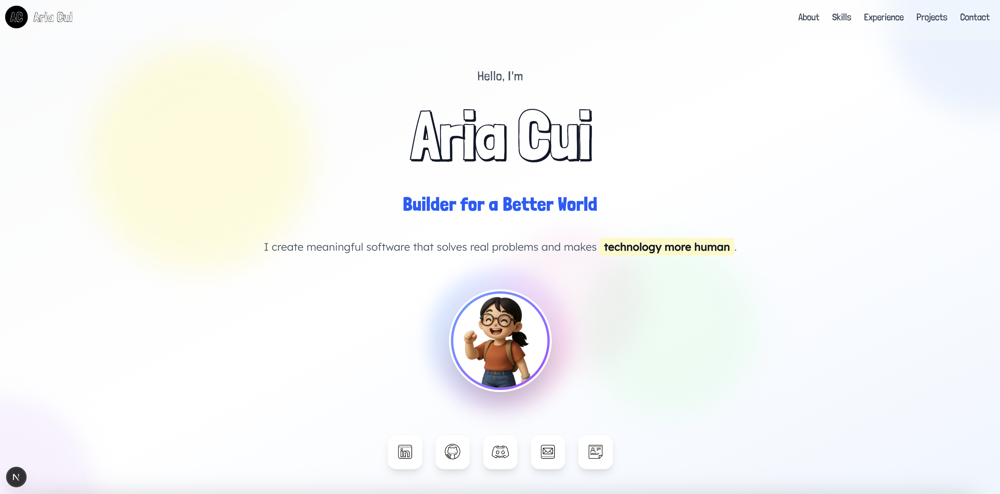

# 🌐 Personal Portfolio

A modern and responsive developer portfolio built with **Next.js** and **Framer Motion**, designed to showcase projects, experience, and skills with engaging animations and smooth user experience.

## ✨ Features

- ⚡ Built with **Next.js** and **TypeScript**
- 🎨 Designed using **Tailwind CSS** with fully responsive layout
- 🎞️ Smooth page transitions and animations via **Framer Motion**
- 📬 Contact form powered by **EmailJS** with status feedback
- 💡 Accessible and SEO-friendly
- 🚀 Deployed via **AWS Amplify**

## 🛠 Tech Stack

- **Framework:** Next.js, React, TypeScript
- **Styling:** Tailwind CSS
- **Animation:** Framer Motion
- **Email:** EmailJS
- **Deployment:** AWS Amplify

## 📧 Contact

Feel free to reach out via the contact form or email me directly.

---

## 📌 Status

🚧 Actively being developed and improved. Feedback and contributions are welcome!